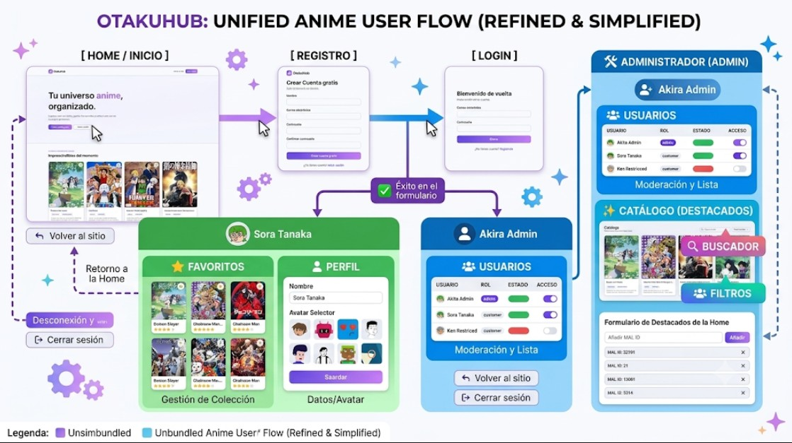
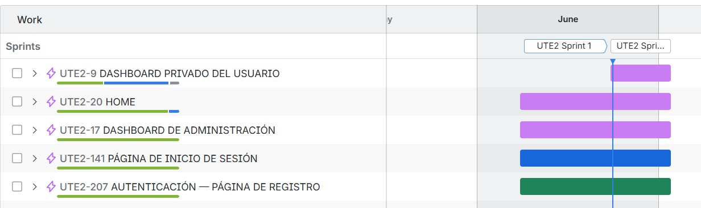
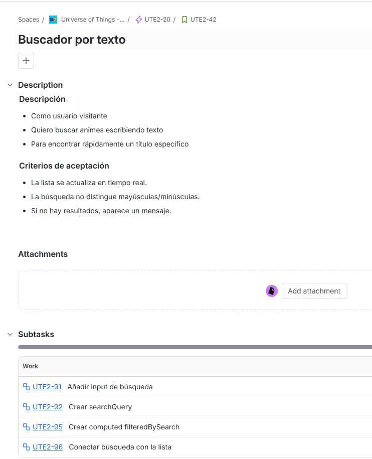
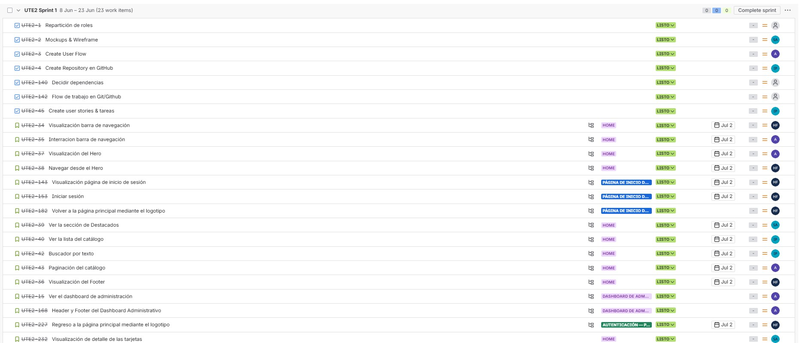
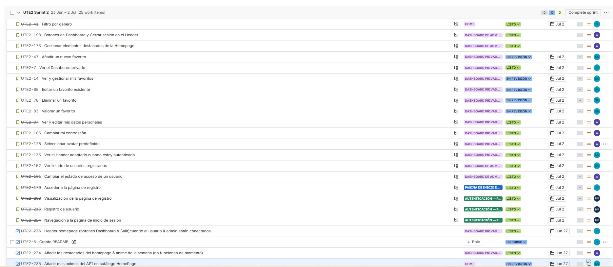

# The Univers of Things

The Univers of Things is a fully responsive **Single Page Application (SPA)** built with **Vue.js**. It provides a public anime catalog and a private favorites area protected by user authentication.

Users can search, filter, and browse anime with pagination, manage their favorites, and update their profile and password. Admin users have access to a dedicated dashboard for user management and featured-content configuration.

The project was developed using an Agile workflow, organized into **two two-week sprints**, with planning and task tracking managed in Jira.

## ✨ Features

- Responsive public anime catalog
- Search, filtering, and pagination
- User registration and authentication
- Personal dashboard and profile management
- Favorites management and rating
- Admin dashboard for users and featured content

## 🛠️ Tech Stack

- **Frontend:** HTML5, CSS3, Sass, Bootstrap, Vue.js
- **State Management:** Pinia
- **Routing:** Vue Router
- **Unit Testing:** Vitest
- **End-to-End Testing:** Playwright
- **Build Tool:** Vite
- **Version Control:** Git and GitHub

## 🖌️ Design and Prototyping

- [Interactive mockups](https://univers-of-things.lovable.app/)
- [Figma wireframe](https://www.figma.com/proto/NFFXZqwMBLzCaRw2PFyiYL/Mockup-Lovable?node-id=6-394&t=Qmjm0Ncs3CmXOENF-1)

## 🔀 User Flow

## 📋 Project Management

### Jira Timeline

### Sample User Story

### Sprint 1

### Sprint 2

## 🧪 Testing

- [Unit Test Screenshots](docs/images/tests/unit-tests/)
- [End-to-End Test Screenshots](docs/images/tests/end-to-end/)

## 🔌 API

Anime data is provided by the [Jikan API](https://api.jikan.moe/v4/anime).

## 📦 Deployment

- [GitHub Pages](https://factoriaf5-asturias.github.io/project-p5-digital-academy-team2-the-univers-of-things/)

## 👩‍💻 Authors

- [Andrea](https://github.com/AndreaVaGo)
- [Hanna](https://github.com/hannafr14)
- [Ioana](https://github.com/Alexapop)
- [Simone](https://github.com/simoneavilarranz)
